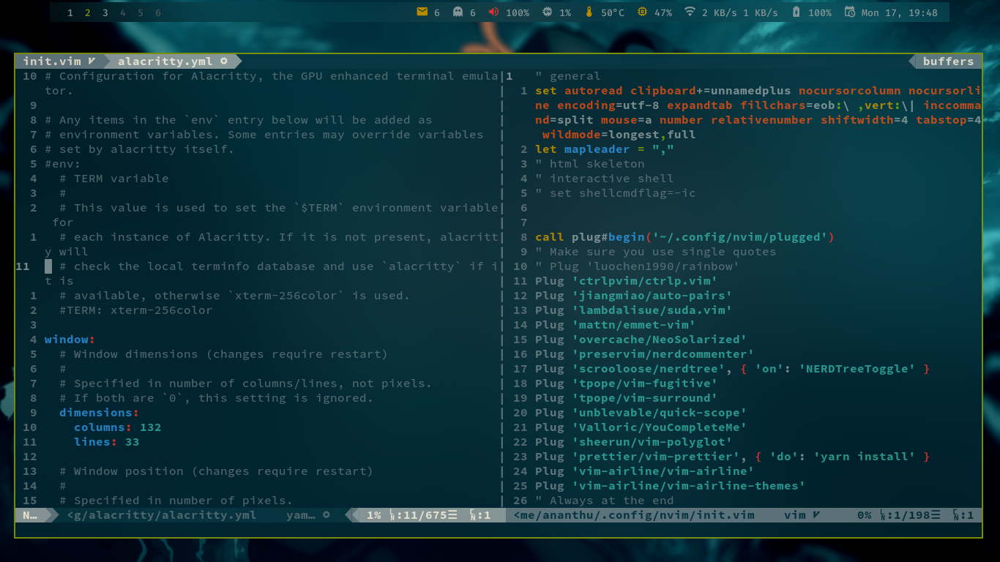

# neovim-config
The minimalist feature rich config for neovim

## Requirement
* Linux; win or mac not tested
* nerd fonts
* True color terminal support, [check here](https://gist.github.com/XVilka/8346728)
* Working nvim, `:checkhealth` for error checking


## Plugins installed
* [ctrlpvim/ctrlp.vim](https://www.github.com/ctrlpvim/ctrlp.vim)
* [jiangmiao/auto-pairs](https://www.github.com/jiangmiao/auto-pairs)
* [lambdalisue/suda.vim](https://www.github.com/overcache/NeoSolarized)
* [overcache/NeoSolarized](https://www.github.com/tpope/vim-commentary)
* [tpope/vim-commentary](https://www.github.com/scrooloose/nerdtree)
* [scrooloose/nerdtree](https://www.github.com/scrooloose/nerdtree)
* [tpope/vim-surround](https://www.github.com/tpope/vim-surround)
* [easymotion/vim-easymotion](https://www.github.com/easymotion/vim-easymotion)
* [vim-airline/vim-airline](https://www.github.com/vim-airline/vim-airline)
* [vim-airline/vim-airline-themes](https://www.github.com/vim-airline/vim-airline-themes)
* [ryanoasis/vim-devicons](https://www.github.com/ryanoasis/vim-devicons)


## Screenshots


## Installation
```
* install nvim
	* Debian
		* sudo apt install neovim
	* Arch
		* sudo pacman -S neovim
* mkdir -p ~/.config
* cd ~/.config
* mv nvim nvim_bak 2>/dev/null
* git clone https://github.com/ask1234560/neovim-config.git nvim
* curl -fLo ~/.vim/autoload/plug.vim --create-dirs https://raw.githubusercontent.com/junegunn/vim-plug/master/plug.vim
* open nvim, :PlugInstall for installing plugins.
```
