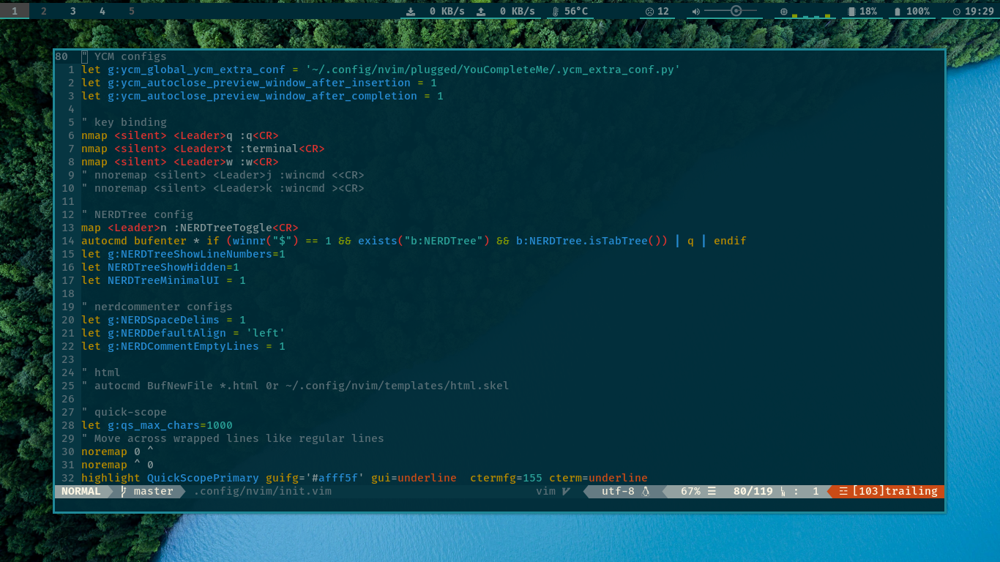

# neovim-config
The minimalist feature rich config for neovim

## Requirement
* Linux; win or mac not tested
* Patched fonts aka nerd fonts
* True color terminal support, [check here](https://gist.github.com/XVilka/8346728)
* Working nvim, `:checkhealth` for error checking


## Plugins installed


* [joshdick/onedark.vim](http://www.github.com/joshdick/onedark.vim)
* [vim-airline/vim-airline](http://www.github.com/vim-airline/vim-airline)
* [tpope/vim-fugitive](http://www.github.com/tpope/vim-fugitive)
* [morhetz/gruvbox](http://www.github.com/morhetz/gruvbox)
* [tpope/vim-surround](http://www.github.com/tpope/vim-surround)
* [preservim/nerdcommenter](http://www.github.com/preservim/nerdcommenter)
* [ctrlpvim/ctrlp.vim](http://www.github.com/ctrlpvim/ctrlp.vim)
* [lambdalisue/suda.vim](http://www.github.com/lambdalisue/suda.vim)
* [Valloric/YouCompleteMe](http://www.github.com/Valloric/YouCompleteMe)
* [scrooloose/nerdtree](http://www.github.com/scrooloose/nerdtree)
* [jiangmiao/auto-pairs](http://www.github.com/jiangmiao/auto-pairs)
* [mattn/emmet-vim](http://www.github.com/mattn/emmet-vim)
* [luochen1990/rainbow](http://www.github.com/luochen1990/rainbow)
* [unblevable/quick-scope](http://www.github.com/unblevable/quick-scope)
* [dracula/vim](http://www.github.com/dracula/vim)
* [ryanoasis/vim-devicons](http://www.github.com/ryanoasis/vim-devicons)
* [altercation/vim-colors-solarized](http://www.github.com/altercation/vim-colors-solarized)
* [vim-airline/vim-airline-themes](http://www.github.com/vim-airline/vim-airline-themes)


## Screenshots



## Installation
```
* install nvim
	* Debian 
		* sudo apt install neovim
	* Arch
		* sudo pacman -S neovim
* mkdir -p ~/.config
* cd ~/.config
* mv nvim nvim_bak 2>/dev/null
* git clone https://github.com/ask1234560/neovim-config.git nvim
* curl -fLo ~/.vim/autoload/plug.vim --create-dirs https://raw.githubusercontent.com/junegunn/vim-plug/master/plug.vim
* open nvim, :PlugInstall for cloning plugins, build YouCompleteMe plugin
```

## Key bindings
* Leader => ,
* ,q => :q
* ,t => :terminal
* ,m => most recently used files
* ,o => open file buffers
* ,p => fuzzy finder in current directory
* ,c => set local directory to that of current file
* <c-{h,j,k,l}> => for left, bottom, top, right in split windows
* ,spacebar => :nohls
* 0 and ^ keybinds are interchanged


