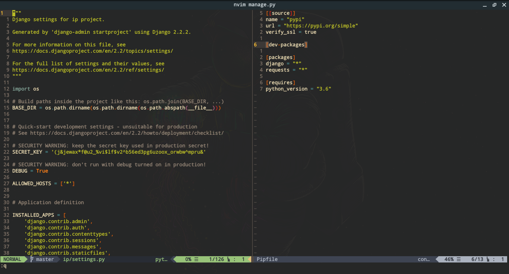
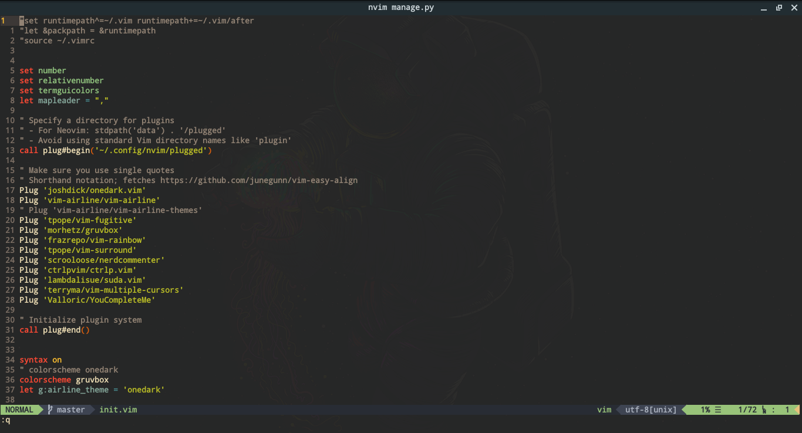
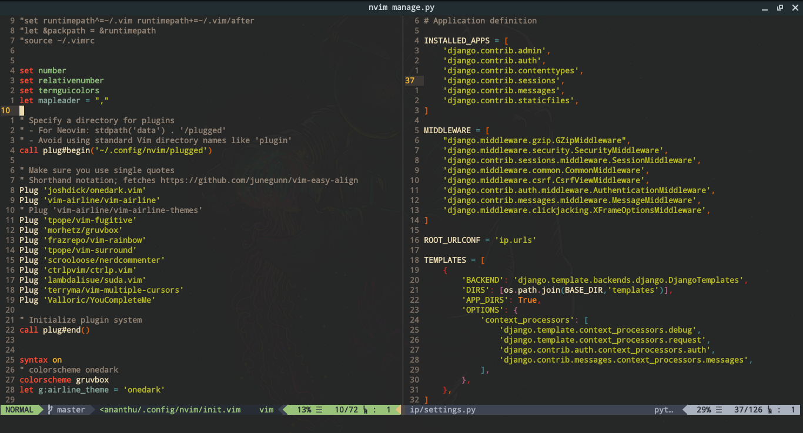
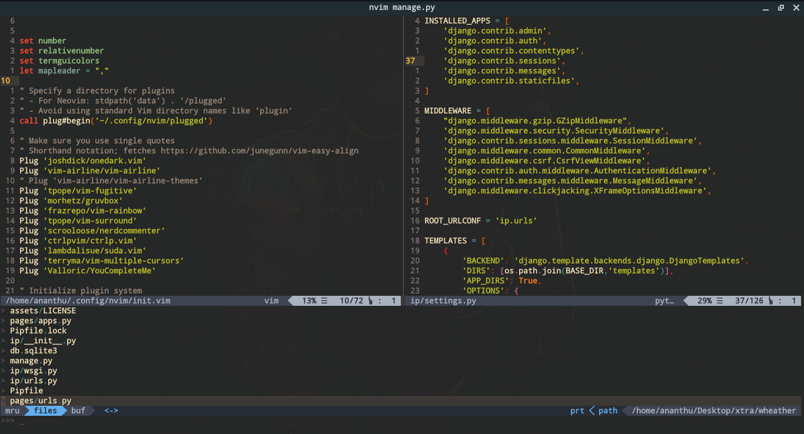
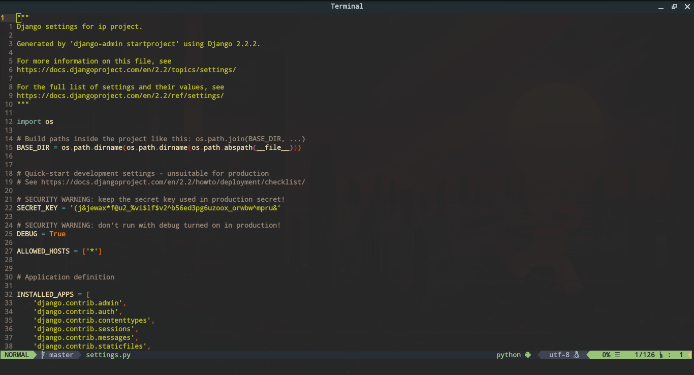
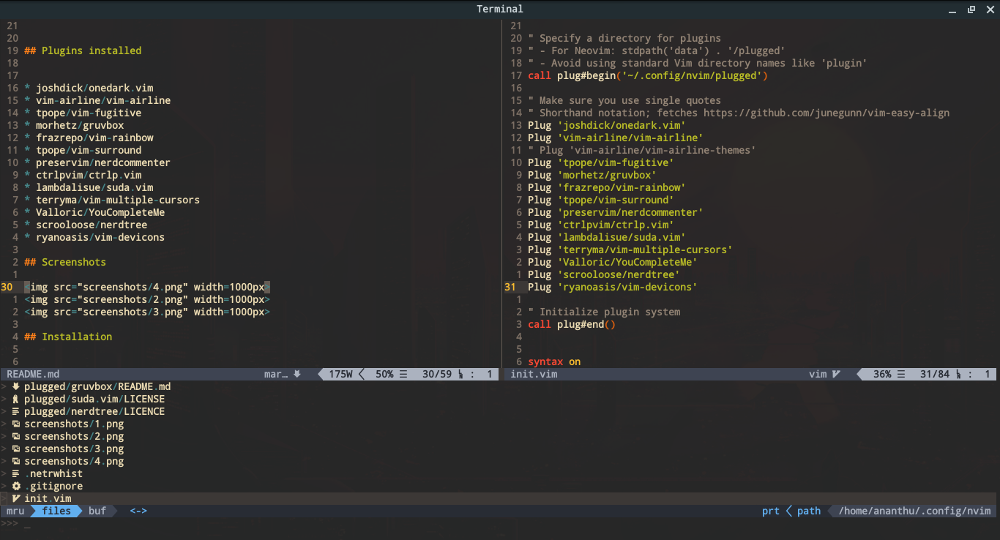
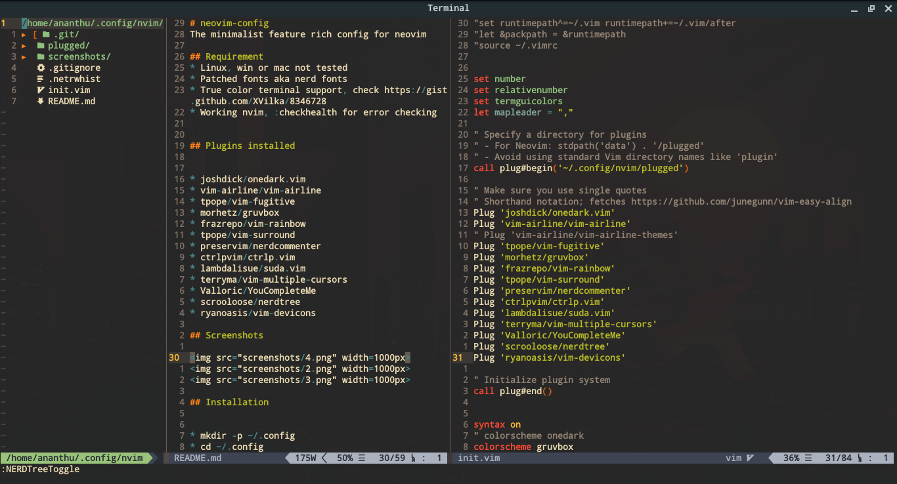

# neovim-config
The minimalist feature rich config for neovim

## Requirement
* Linux; win or mac not tested
* Patched fonts aka nerd fonts
* True color terminal support, check https://gist.github.com/XVilka/8346728
* Working nvim, :checkhealth for error checking

## Plugins installed

* [joshdick/onedark.vim](http://www.github.com/joshdick/onedark.vim)
* [vim-airline/vim-airline](http://www.github.com/vim-airline/vim-airline)
* [tpope/vim-fugitive](http://www.github.com/tpope/vim-fugitive)
* [morhetz/gruvbox](http://www.github.com/morhetz/gruvbox)
* [frazrepo/vim-rainbow](http://www.github.com/frazrepo/vim-rainbow)
* [tpope/vim-surround](http://www.github.com/tpope/vim-surround)
* [preservim/nerdcommenter](http://www.github.com/preservim/nerdcommenter)
* [ctrlpvim/ctrlp.vim](http://www.github.com/ctrlpvim/ctrlp.vim)
* [lambdalisue/suda.vim](http://www.github.com/lambdalisue/suda.vim)
* [terryma/vim-multiple-cursors](http://www.github.com/terryma/vim-multiple-cursors)
* [Valloric/YouCompleteMe](http://www.github.com/Valloric/YouCompleteMe)
* [scrooloose/nerdtree](http://www.github.com/scrooloose/nerdtree)
* [ryanoasis/vim-devicons](http://www.github.com/ryanoasis/vim-devicons)
* [jiangmiao/auto-pairs](http://www.github.com/jiangmiao/auto-pairs)

## Screenshots

#### After devicons

## Installation

* mkdir -p ~/.config
* cd ~/.config
* mv nvim nvim_bak 2>/dev/null
* git clone https://github.com/ask1234560/neovim-config.git nvim

* curl -fLo ~/.vim/autoload/plug.vim --create-dirs https://raw.githubusercontent.com/junegunn/vim-plug/master/plug.vim
    
* open nvim, :PlugInstall for cloning plugins, build __YouCompleteMe__ plugin

## Key bindings
* Leader => ,
* ,q => :q
* ,t => :terminal
* ,m => most recently used files
* ,o => open file buffers
* ,p => fuzzy finder in current directory
* ,c => set local directory to that of current file
* <c-{h,j,k,l}> => for left, bottom, top, right in split windows
* ,spacebar => :nohls

