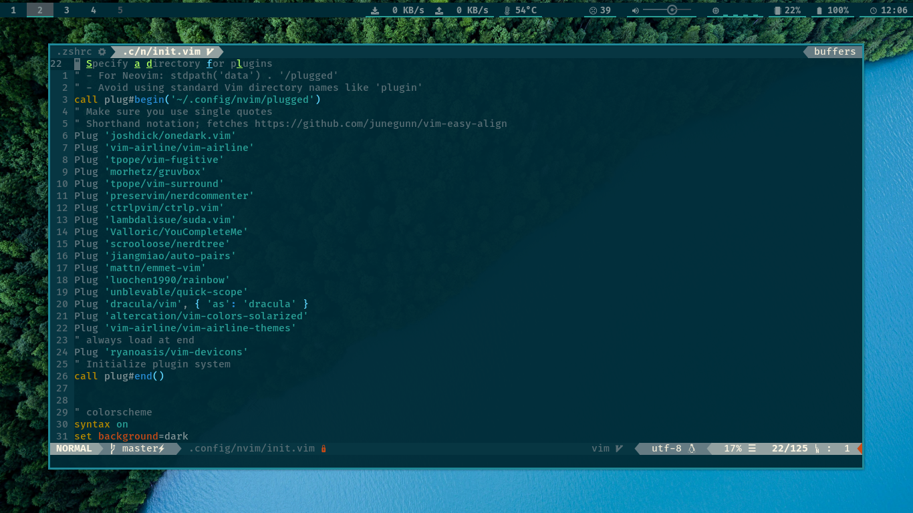

# neovim-config
The minimalist feature rich config for neovim

## Requirement
* Linux; win or mac not tested
* Patched fonts aka nerd fonts
* True color terminal support, [check here](https://gist.github.com/XVilka/8346728)
* Working nvim, `:checkhealth` for error checking


## Plugins installed
* [Plug 'altercation/vim-colors-solarized'](http://www.github.com/Plug 'altercation/vim-colors-solarized')
* [Plug 'ask1234560/vim-devicons'](http://www.github.com/Plug 'ask1234560/vim-devicons')
* [Plug 'ctrlpvim/ctrlp.vim'](http://www.github.com/Plug 'ctrlpvim/ctrlp.vim')
* [Plug 'jiangmiao/auto-pairs'](http://www.github.com/Plug 'jiangmiao/auto-pairs')
* [Plug 'lambdalisue/suda.vim'](http://www.github.com/Plug 'lambdalisue/suda.vim')
* [Plug 'mattn/emmet-vim'](http://www.github.com/Plug 'mattn/emmet-vim')
* [Plug 'preservim/nerdcommenter'](http://www.github.com/Plug 'preservim/nerdcommenter')
* [Plug 'scrooloose/nerdtree'](http://www.github.com/Plug 'scrooloose/nerdtree')
* [Plug 'tpope/vim-fugitive'](http://www.github.com/Plug 'tpope/vim-fugitive')
* [Plug 'tpope/vim-surround'](http://www.github.com/Plug 'tpope/vim-surround')
* [Plug 'unblevable/quick-scope'](http://www.github.com/Plug 'unblevable/quick-scope')
* [Plug 'Valloric/YouCompleteMe'](http://www.github.com/Plug 'Valloric/YouCompleteMe')
* [Plug 'vim-airline/vim-airline'](http://www.github.com/Plug 'vim-airline/vim-airline')
* [Plug 'vim-airline/vim-airline-themes'](http://www.github.com/Plug 'vim-airline/vim-airline-themes')

<!-- macro {y$I* Wv$hS]$a(http://www.github.com/pj0} -->
## Screenshots



## Installation
```
* install nvim
	* Debian 
		* sudo apt install neovim
	* Arch
		* sudo pacman -S neovim
* mkdir -p ~/.config
* cd ~/.config
* mv nvim nvim_bak 2>/dev/null
* git clone https://github.com/ask1234560/neovim-config.git nvim
* curl -fLo ~/.vim/autoload/plug.vim --create-dirs https://raw.githubusercontent.com/junegunn/vim-plug/master/plug.vim
* open nvim, :PlugInstall for installing plugins, build YouCompleteMe plugin
```

## Key bindings
```
* Leader => ,
* ,q => :q
* ,t => :terminal
* ,m => most recently used files
* ,o => open file buffers
* ,p => fuzzy finder in current directory
* ,c => set local directory to that of current file
* <c-{h,j,k,l}> => for left, bottom, top, right in split windows
* ,spacebar => :nohls
* 0 and ^ keybinds are interchanged
* ,l/,h => buffer next/buffer prev
```
